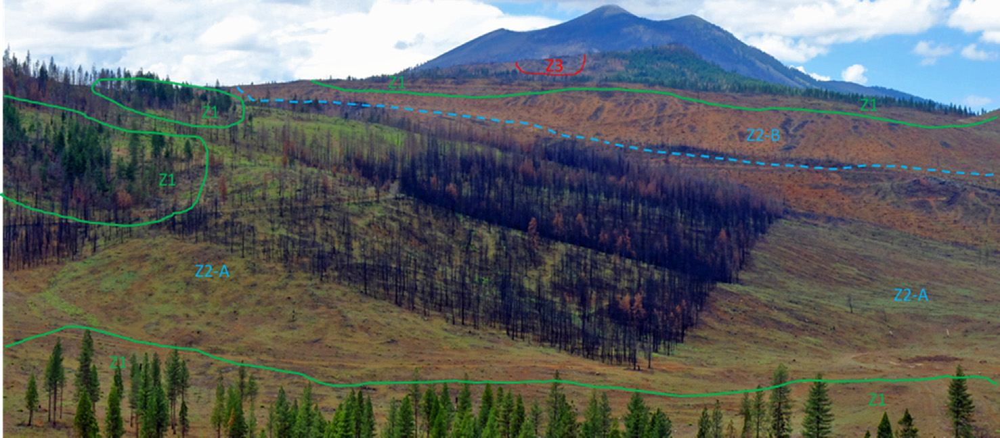
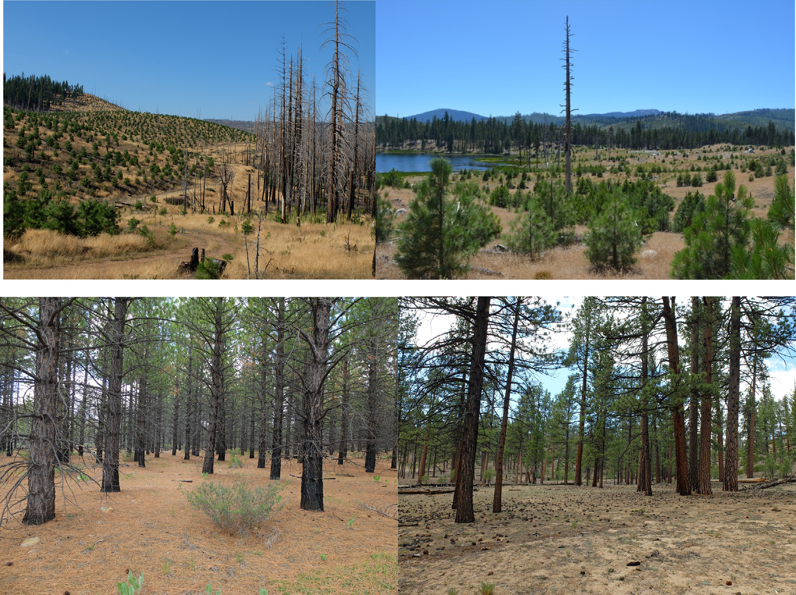
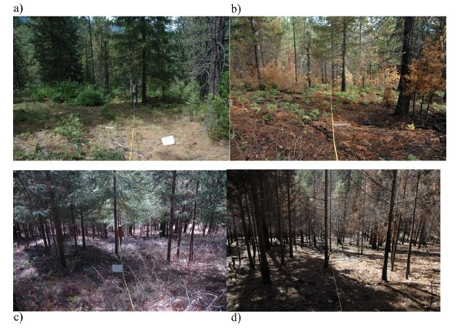
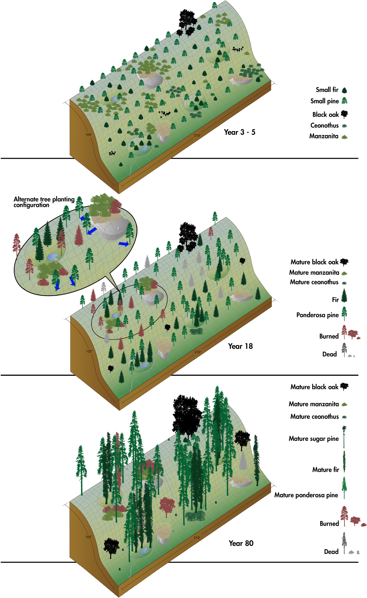

# Best Management Practices for climate-wise reforestation

This document outlines some recent advances in how to think about approaching reforestation in an age of climate change and altered disturbance regimes. We rely heavy on the 2019 [*Tamm Review: Reforestation for resilience in dry western U. S. forests*](https://www.sciencedirect.com/science/article/pii/S0378112718313161?via%3Dihub) by North et al, which readers are encouraged to review for further details. For brevity, conventional reforestation practices are not covered here. It is our hope that practitioners will incorporate these state of the science strategies with previously established forestry knowledge and tailor solutions for each unique project.  

## Table of Contents  

(1) Seed Zonation  

(2) Seedling Density and Spatial Arrangement  

(3) Species Composition  

(4) Prescribed Burning in Young Stands

(5) Example Reforestation Scenario  

## 1 - Seed Zonation  

We suggest areas of recent drought- or wildfire-caused tree mortality be subdivided into three management zones:  

  1) Areas where natural tree recruitment is likely to be successful and active reforestation is unnecessary. Specifically aforested lands near existing seed sources. As a course rule of thumb, areas within 650ft (200m) of live trees can be designated as zone 1. However, field ( [Welch et al. 2016](https://esajournals.onlinelibrary.wiley.com/doi/full/10.1002/ecs2.1609) ) and geospatial ( [Shive et al. 2018](https://esajournals.onlinelibrary.wiley.com/doi/10.1002/eap.1756) ) tools can be used to more precisely identify where natural recruitment will most likely be successful.  
  
  2) Areas where natural recruitment will likely be sparse or non-existent and where active reforestation should be focused. Zone 2 can be defined as aforested lands outside of zone 1, where existing roads and moderate topography allow for efficient reforestation, and where forests are the desired ecological state.  
  
  3) Stands which would otherwise be included in zone 2 but where reforestation is prohibitively costly due to remoteness or topography, or where non-forested states are desirable.  

 
**Tamm Review Figure 3.** *"A partially salvaged area two years after the 2014 Eiler Fire near Burney, California. Zone 1, outlined in green, indicates areas likely to receive seed from adjacent islands of green trees. Zone 2, in the remaining area beyond most natural recruitment, are the areas readily accessible for reforestation. Two areas within this zone, A and B separated by the blue dashed line, indicate gentler, more uniform topography (A) and more variable, steeper sloped conditions (B), each of which could have a different planting strategy discussed in the text. The unsalvaged, snag area in the center could be planted if safety allows (facilitating future forest habitat connectivity) or left to provide wildlife habitat for post-fire specialists. Zone 3, outlined in red in the distant center of the photo, is a steep slope, distant from access roads that might be planted with founder stands (groups of seedlings in mesic, sheltered microsites less likely to burn or become drought stressed)."*  
 

<!-- ### *1b - Justification*   -->

<!-- Conifer tree seed density declines with distance from source. Where tree mortality is a result of drought and/or beetle attack, recently killed trees may serve as sources *[correct?]*. For non-serotinous species, fire-killed trees do not provide a source of seeds, and propogules must come from surviving individuals. Without more detailed information, 200m or approximately 650 feet from living trees can be used as a rough cutoff, where expected natural recruitment falls to non-existent or sparse. Recently, tools have been developed to assess natural recruitement potential in the field and using geospatial information. If utilized such tools can better dilineate areas that are likely to experience natural reforestation (zone 1) from those where active management may be necessary (zone 2).   -->

<!-- In addition to active reforestation often being uncessesary where living seed sources exist, the scale of mortality events are increasing. With limited funds available, it may be infeasible to actively reforest all areas outside of zone 1 and there may be areas where non-forest vegetation communities are desirable for ecological or other purpose (i.e. zone 3). For example, zone 3 may include areas where conventional reforestation would prohibively expensive (e.g. steap slopes and areas isolated from existing roads) or it may it may include areas that prior to the fire-suppression era likely supported meadow or mountain chaparral habitats.   -->

## 2 - Seedling Density and Spatial Arrangement  

Plant seedlings in lower densities and with higher spatial heterogeniety than conventional "pines in lines" approaches. Plantations that emulate a pattern of individual scattered trees, clumps of trees, and openings (ICO) are more likely to be resilience to increasing rates of droughts and wildfires. Whenever possible, clusters of seedlings and relatively densely planted areas should be aligned with topographic and soil conditions that support greater available water and water holding capacity, as well as areas of potential fire refugia.  

 
**Tamm Review Figure 1.** *"Different tree planting patterns compared to an ‘ICO’ stand structure. Upper left is area burned by the 2007 Moonlight Fire seven years after the fire. The left side of the road is private land regularly planted with ponderosa pine and treated with herbicide. The right side of the road, U.S. Forest Service land, was left unsalvaged and unplanted. The upper right photo is a cluster planted area ten years after the 2006 Boulder Fire. Lower left is a 50-year old ponderosa pine plantation nearby but outside the Moonlight and Boulder burns. The lower right photo shows the ‘ICO’ pattern produced by an active fire regime in an unmanaged Jeffrey pine stand in the Sierra San Pedro del Martir, Baja, Mexico."*  

## 3 - Species Composition  

Promote mixed-species stands dominated by drought and fire-resistent trees such as pines, particularly in drier areas (e.g. southwest-facing slopes). Within active reforestation areas (i.e. zone 2), the species mix can be determined at the time of planting. In areas of passive reforestation (i.e. zone 1), managers may choose to interplant pines among natural regenerating pines if nearby seed trees are primarily composed on drought and fire-intolerant species (e.g. firs and cedars).  

## 4 - Prescribed Burning in Young Stands  

Introduce prescribed fire to planted stands early to emulate natural fire return intervals of 5-10 years for yellow pine and 10-20 years for mixed conifer forests. Emerging research suggests prescribed fire in yound stands can support multiple management objects while resulting in relatively low levels of tree mortality. Such treatments can be used to reducing surface fuels, maintain the evolutionary selection for fire-resistant trees, promote stand heterogeneity, and avoid the high costs and production of activity furels associated with some mechanical treatments. However, prescriptions developed for mature stands will likely need to be adjusted to accomodate burning in young stands.  

 
**Tamm Review Figure 7.** *"Examples of prescribed burning in young stands on the Shasta-Trinity National Forest. The upper pair are before (a) and after (b) photos from a mixed-conifer plantation that was masticated and burned (in spring) 33 years after planting, showing reduction in surface fuels and removal of some understory stems. The lower pair are before (c) and after (d) photos from a plantation with considerable added tree density due to natural regeneration, that was masticated, branch pruned, and burned (in fall) 25 years after planting. In the latter case, the prescribed fire was effectively a pre-commercial thinning, reducing stand density closer to desired levels and also generating within-stand spatial heterogeneity."*  

## 5 - Example Reforestation Scenario    

From North et al. (2019), a theoretical planting strategy and stand development according to the recommendations highlighted here:  

 
**Tamm Review Fig. 6.** *"Schematic of the initial planting and stand development for a dissected, more fire and drought prone 0.2 ha (0.5 ac, 105 by 210 ft) slope of mixed-conifer forest where favorable cluster microsites are more easily identified. (A) Initial planting schematic (usually within 1–5 years following disturbance). First more mesic microsites (concavities in the figure) are identified and planted with clusters of trees and then the remaining area is planted with individual trees on a regularly spaced grid (here 4.6 m or 15′ by 15′). In this example only 60 of 115 (i.e., if fully planted on a 4.6 m spacing) potential trees are regularly planted, and 22 are planted in four clusters at mesic microsites. (B) After the first burn (15 years after planting). In this hypothetical example, of the 82 original conifers, eight have died over the last period and nine were killed by the prescribed fire, reducing live tree density to 65 on the 0.2 ha (0.5 ac). The prescribed fire, designed to maintain tree and shrub separation, has also killed some shrubs. (C) After 77 years of growth. Fire has been applied every 15 years to reduce fuels and shrub cover. In this example, 22 more trees have been killed by drought and prescribed fire, leaving a mature forest density of 40 conifer and three oak live trees (212 tree/ha or 86 trees/ac), within the estimated historical mixed conifer density range of 59–329 tree/ha (24–133 trees/ac) (Safford and Stevens, 2017)."*  

